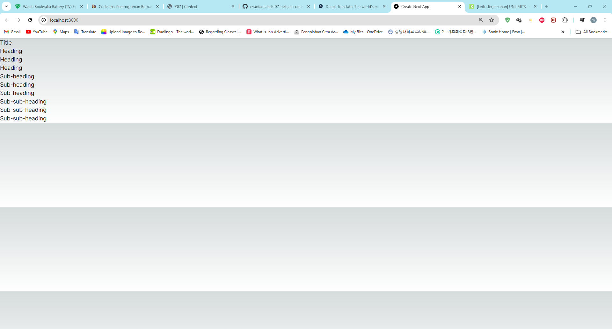
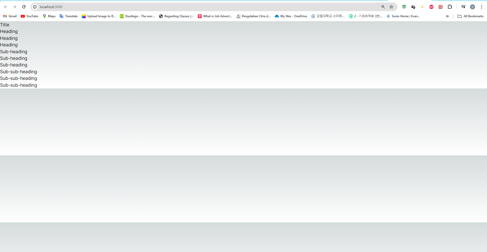
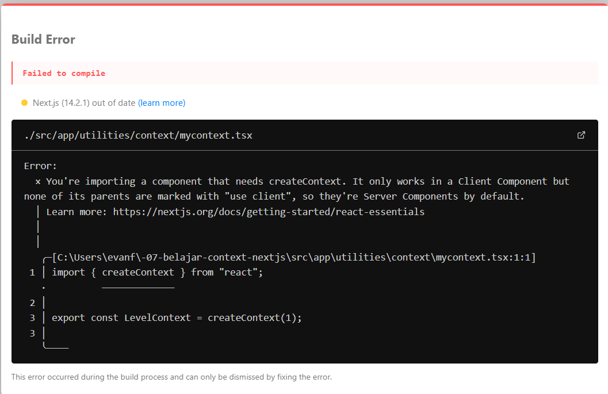
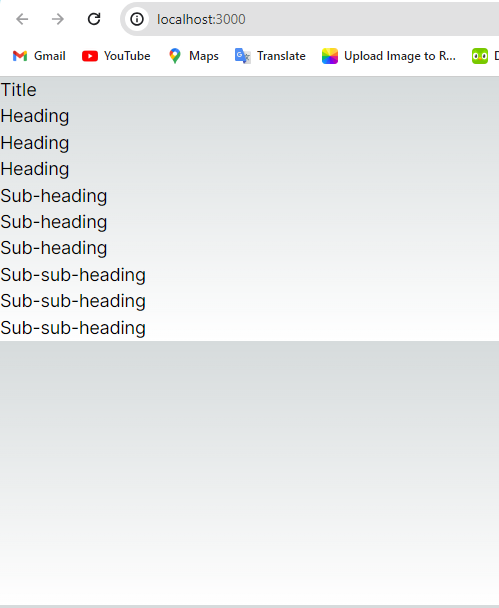
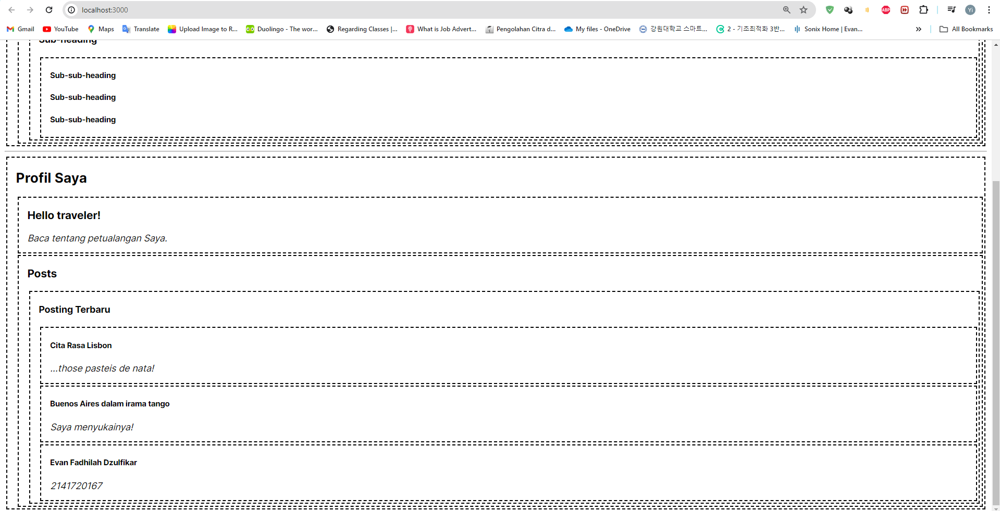
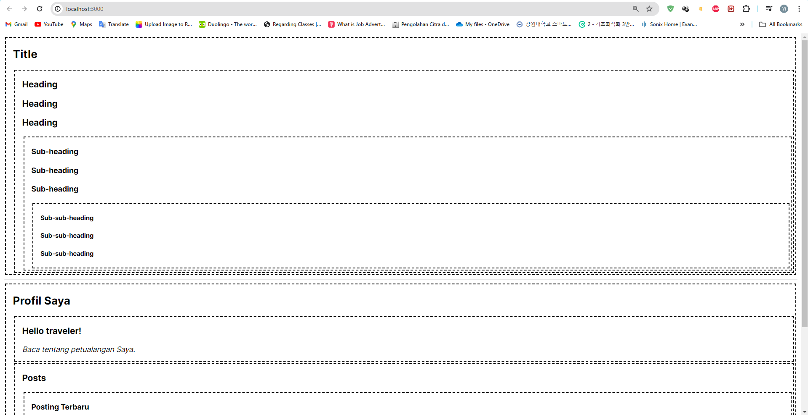
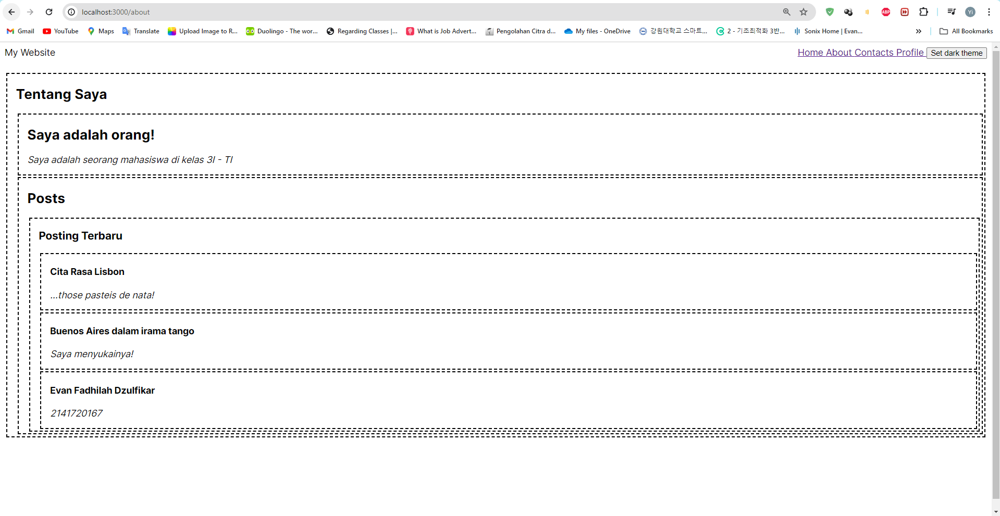
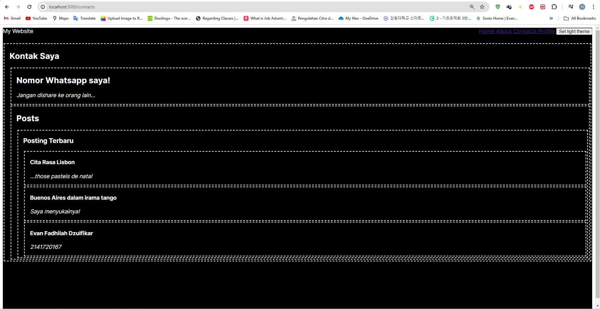

## Laporan Praktikum

|  | Pemrograman Berbasis Framework 2024 |
|--|--|
| NIM |  2141720167|
| Nama |  Evan Fadhilah Dzulfikar |
| Kelas | TI - 3I |

### Practicum 1

"Problem 1 : Capture the results and make a report in README.md. Explain what you have learned and how it looks now?"

    We can give section that have other section (child component) like in this practicum.
    In the inspect code, there are 4 section in this page.
    Section 1 : Include Title and 3 other section
    Section 2 : Include 3 Heading and 2 other section
    Section 3 : Include 3 Sub-heading and 1 other section
    Section 4 : Include 3 Sub-sub-heading

 

"Problem 2: Capture the results and make a report in README.md. Explain what you have learned and how it looks now?"

    There is a way to "request" data from somewhere up the tree that props alone cannot do. 

    This is where context comes in. Which can be done in three steps:
    1. Create a context. (You can name it LevelContext, since it's for the title level.)
    2. Use the context from the component that needs the data. (Heading will use LevelContext.)
    3. Provide the context from the component that specifies the data. (Section will provide LevelContext.)

"If there is an error, please fix it, why did it happen? Explain!"

    There is error says that importing a component need createContext, but it's only work in that page. Or in other word it is by default become a server component.
    So, we need to add "use cient"; in page.tsx

 

"Problem 3: Capture the results and create a report in README.md. Explain what you have learned and how it looks now?" 

    In this practicum, we make the Heading and Section read and use LevelContext to find out how "deep" they are. And Section wraps its children into LevelContext to determine that whatever is inside is at a "deeper" level.
    By doing that, we don't need to add Level of the section or heading manually in the page!

 

### Practicum 2

"Problem 4 : Capture the results and create a report in README.md. Add the text Name and NIM to the Post component to show it's your work!"   

 

### Practicum 3

"Problem 5 : Please save everything and run it in your browser. Capture the results and create a report in README.md."
"Add Name and NIM text on each routing page to show it's your own work!"  

"1. Is the theme toggle button working? If not, please fix it!"

    It's already working

 

"2. Why when refreshing or switching pages the theme is not permanent? Make it permanent even though the page has been refreshed and moved!"

    Because the theme variable is not stored when we switch to other pages.
    To make the theme permanent even after refreshing or navigating between pages, we can utilize browser storage mechanisms like local storage.

    

 
