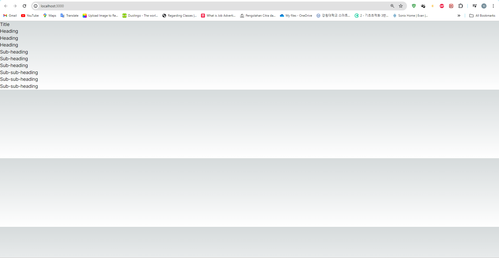

## Laporan Praktikum

|  | Pemrograman Berbasis Framework 2024 |
|--|--|
| NIM |  2141720167|
| Nama |  Evan Fadhilah Dzulfikar |
| Kelas | TI - 3I |

### Practicum 1

"Problem 1 : Capture the results and make a report in README.md. Explain what you have learned and how it looks now?"

    We can give section that have other section (child component) like in this practicum.
    In the inspect code, there are 4 section in this page.
    Section 1 : Include Title and 3 other section
    Section 2 : Include 3 Heading and 2 other section
    Section 3 : Include 3 Sub-heading and 1 other section
    Section 4 : Include 3 Sub-sub-heading

 

